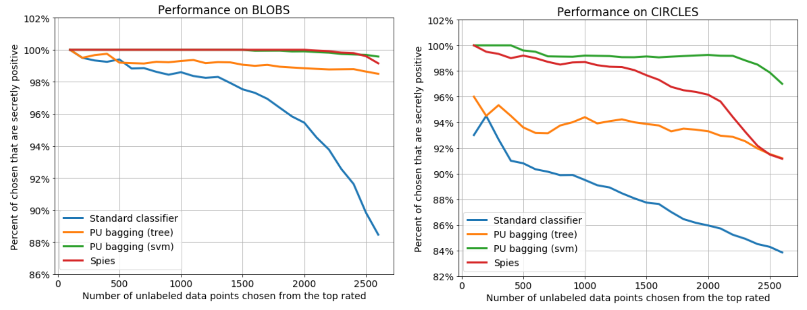

# PU Learning

PU learning - method where binary classifier is learned in a semi-supervised way from only positive and unlabeled sample points. It is especially usefull as a worm start for some applications. After trying out multiple methods from [Bing Lu](https://www.cs.uic.edu/~liub/NSF/PSC-IIS-0307239.html) webpage also recent Masashi Sugiyama works and [this blog post](https://roywright.me/2017/11/16/positive-unlabeled-learning/) I stumbled upon one forum post which lead me to the paper by Liu, Bing, et al. "Partially supervised classification of text documents." ICML. Vol. 2. 2002. It contains beautiful idea of Spies which will be implement here and outperforms all other methods by a huge margin.

## Spies method


General idea follows these steps:

1. Train model on MS (mix + spies) as negative class and P (positive) as positive class.
2. Use trained model on MS to predict likelihoods and based on distribution of S choose threshold such that S are separated well. This leads to N (likely negative group with some S) and U (unlabeled group, containing most of S).
3. Use N as negative and P as positive group to train new classifier. Use it as your final model.

Note, that spies uses two models on the way and any classifier can be used. In experimental results presented bellow *XGBClassifier* will be used.

## Usage

All you need is *pu_learning.py* file (everything else in this repo are just for explanation purposes).

To use spies method you should pass two models and then use fit and predict actions as follows:

```python
from pu_learning import spies
model = spies(XGBClassifier(), XGBClassifier())
model.fit(X, y)
model.predict(X)
```

## Experiments

Experiments were executed using notebook from [this blog post](https://roywright.me/2017/11/16/positive-unlabeled-learning/). I have used *baggingPU.py* from [this repo](https://github.com/roywright/pu_learning) so that we have some benchmark to beat.

Results achieved by PU spies.


When compared to other methods, PU spies clearly stands out.



